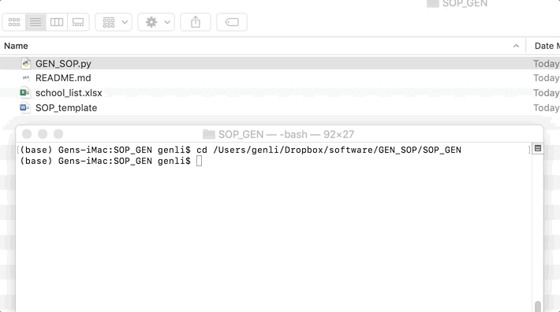

# Statement of Purpose (SOP) Generator -- docx version (DansonGo 5)

A simple module for generating a bunch of SOPs for different schools.


## Description

Using the same content framework, the model will generate multiple SOPs for different schools by replacing the school and program names with the target school and program in the statement.





## Prerequisites

- An excel that includes school names and program names (e.g., [school_list.xlsx](school_list.xlsx))
- A docx file of your statement template (e.g., [SOP_template.docx](SOP_template.docx))


## How to use (Mac)

#### Method 1: Run from terminal

Run "GEN_SOP.py" in terminal from the folder that contains "**GEN_SOP.py**" and **two prerequisite files**.

1. Rename your school list excel file as "**school_list.xlsx**".

2. In "school_list.xlsx", please make sure that the school and program column names are "**School**" and "**Program**", respectively. (TAKE CARE OF THE FIRST CAPITAL LETTER)

3. Rename your docx as "**SOP_template.docx**"

4. In your "SOP_template.docx", please label the school position as "**[SCHOOL_NAME]**". Please label the program position as "**[PROGRAM_NAME]**"

5. Run the command below from terminal

   

```python
python GEN_SOP.py
```


#### Method 2: Run as module

```python
from GEN_SOP import GEN_SOP

GEN_SOP(school_list,SOP_temp_file,School_var,Program_var,output_path).gen_sop()
```

school_list : The excel file path where the list of schools and programs is saved.

SOP_temp_file : The docx file path of your SOP template.

School_var : The column name where the school name is saved in your school list.

Program_var : The column name where the program info is saved in your school list.

output_path : Output path where you want to save your output files.


## Contributor

* [Gen Li](https://www.gen-li.com)